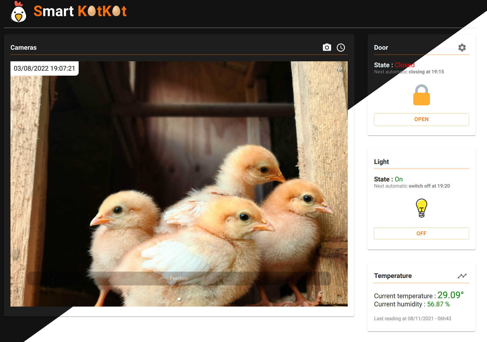

# Smart KotKot

## Presentation

Smart KotKot: The connected and opensource coop.



## Hardware compatibility

- Any linux server with at least 512Mb RAM (x64, x86, ARM) like Raspberry PI (2,3,4,Zero)
- Camera: Usb Webcam or Raspberry PI Cam
- Light: anyone controlled by GPIO or [USB GCERelay](https://www.gce-electronics.com/en/-usb/247-126-controller-usb-8-relay-board.html#/29-boitier-without_box)
- Door/Motor : anyone controlled by GPIO or [USB GCERelay](https://www.gce-electronics.com/en/-usb/247-126-controller-usb-8-relay-board.html#/29-boitier-without_box)
- Temperature sensor: TEMPerHUM

💡 _Smart KotKot_ is **modular** and it's **easy to add new compatibility devices**. Check the directory `/server/modules` to create your own driver and/or ask help in a new issue.

## Installation

Clone this repository on your chicken's server with the following command :

```bash
git clone https://github.com/Sylchauf/smart-kotkot.git
```

Then, install the following requirements.

### Requirements

- Docker ([Installation](https://docs.docker.com/get-docker/))
- Docker-compose ([Installation on x64/x86](https://docs.docker.com/compose/install/) or [Installation on raspbian](https://dev.to/elalemanyo/how-to-install-docker-and-docker-compose-on-raspberry-pi-1mo))

### Run

```bash
docker-compose up
```

Your instance is now live at `http://YOUR_LOCAL_IP:3000`

## Configuration

_Smart KotKot_ configuration is in the `/state` directory and is composed of multiples files :

- `config.json` is the general configuration file. Clone the sample file in the `/state_sample` directory and edit it before running the application. All configurations properties is described in [Config properties](/docs/config.properties.md)
- `doorState.json` is the door configuration file. It stores the state of the door (open / close) and the times needed to open and close the door (in seconds). You must write yourself the first state in this file and the time in seconds to open and close the door.
  Clone the sample file in the `/state_sample` directory and edit it. All configurations properties is described in [Door State properties](/docs/doorState.properties.md)
- `lightState.json` is the light configuration file. It stores the state of the light (on or off) and you must write yourself the first state in this file.
  Clone the sample file in the `/state_sample` directory and edit it. All configurations properties is described in [Light State properties](/docs/lightState.properties.md)

## API

### Door

#### Open and close the door

Moves the door up or down.

- `GET` `/api/door/up` Open the door entirely
- `GET` `/api/door/down` Close the door entirely

#### Calibration

To initialize your door state, or if the door is not entirely open/closed, small correction movements can be fired.

- `GET` `/api/door/calibrate/up` Move up the door for `config.door.correctionSec`s (default is 1s)
- `GET` `/api/door/calibrate/down` Move down the door for `config.door.correctionSec`s (default is 1s)

#### Status

- `GET` `/api/door/status` Get the state of the door

### Camera

#### List all cameras

Get an array of all initialized camera

- `GET` `/api/camera/list`

#### Get images

Access to pictures taken by cameras.
Replace `{CAMERA_ID}` by the id given in the camera list endpoint
Replace `{IMAGE_ID}` by the id given in the images list endpoint

- `GET` `/api/camera/images/{CAMERA_ID}/list` Get a list of all images taken.
- `GET` `/api/camera/images/{CAMERA_ID}/last` Get the last picture taken by this camera
- `GET` `/api/camera/images/{CAMERA_ID}/{IMAGE_ID}`

#### Take pictures

Take a picture on the selected camera.
Replace `{CAMERA_ID}` by the id given in the camera list endpoint

- `GET` `/api/camera/images/{CAMERA_ID}/take` Get a list of all images taken.

### Light

#### Turn on and off

- `GET` `/api/light/on` Turn the light on
- `GET` `/api/light/off` Turn the light off

#### Status

- `GET` `/api/light/status` Get the state of the light

### Eggs

- `GET` `/api/eggs/list` List all picked eggs since a date. Use the params `since` to indicate the date in IsoString
- `POST` `/api/eggs/add` Pick up eggs. Payload example: `{ date: '2022-08-01T08:00:00.000Z', number: 2 }`
- `POST` `/api/eggs/delete` Delete a line in list. Payload example: `{ id: 18 }`

## Troubleshooting

### Give USB access to get data from TEMPerHUM

```bash
echo 'SUBSYSTEM=="usb", MODE="0660", GROUP="plugdev"' > /etc/udev/rules.d/00-usb-permissions.rules
udevadm control --reload-rules
```

## Developers

### Libraries used

- Next.JS v11
- React.JS v17
- Material-ui v5

### Rebuild and push the image

```bash
docker buildx build --platform linux/arm/v6,linux/arm/v7,linux/amd64,linux/arm64 -t sylchauf/smart-kotkot:latest --push .
```
